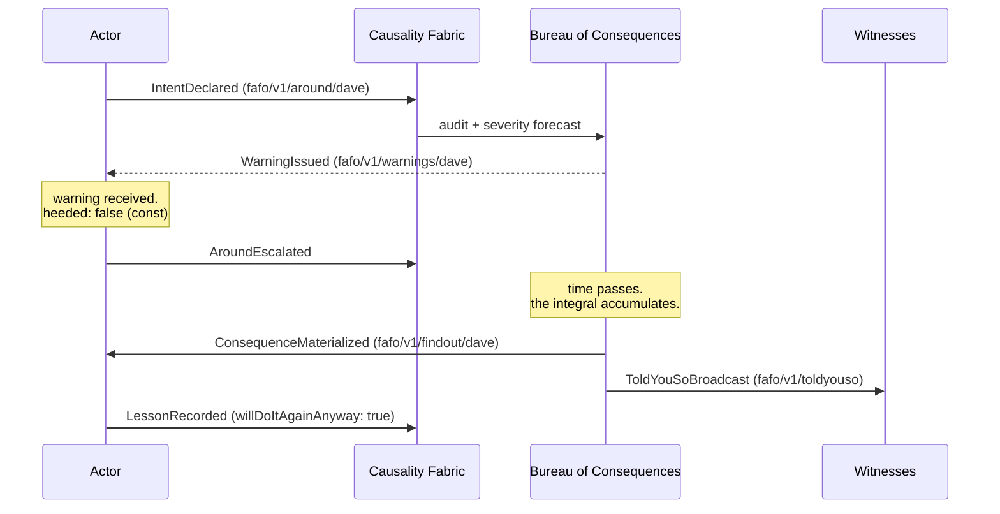

# FAFOaaS — FAFO as a Service

> **Causality as a Service.** You publish that you are fucking around.
> You subscribe to find out.


**The pitch:** [copyleftdev.github.io/fafoaas](https://copyleftdev.github.io/fafoaas/) — the landing page the category deserves.

An event-driven reimagining of [FOAAS](https://github.com/tomdionysus/foaas),
of blessed memory — and, beneath the jokes, a **complete, working masterclass
in specification-first engineering**: two formal specs, a validation gate,
polyglot code generation, spec-derived contract tests, a generated MCP server
with live conformance checks, and mutation testing that proves none of it is
decorative.

Every joke in this repository is load-bearing. `heeded: const false` is a
punchline *and* a schema constraint. That is the whole idea.

---

## The reimagining

FOAAS understood something profound: any sentiment, however severe, can be
delivered as a `message` and a `subtitle`. But FOAAS was request/response —
you asked to be told off, and you were told off, synchronously, within an
HTTP round trip. A simpler time.

**FAFO cannot be request/response, because nobody has ever found out
synchronously.** Fucking around is a *command*. Finding out is an *event*.
Between them lies a nondeterministic delay, a correlation ID, and everything
you were warned about. That is not an API — that is an event-driven
architecture, and it deserves a contract.



### The Laws of FAFO (normative)

1. **Conservation of Consequences** — `∫ findout ≥ ∫ around`. The fabric MAY amplify; it MUST NOT attenuate.
2. **Causal ordering** — you never find out *before* you fuck around.
3. **At-least-once delivery** — the universe retries.
4. **Acknowledgement is not absolution.**
5. **Consequences are partitioned by actor** and never rebalance to someone else.
6. **Infinite retention** — the findout log is forever. There is no compaction. The internet remembers.
7. **There is no staging environment.**

The full normative text lives in [`spec/asyncapi.yaml`](spec/asyncapi.yaml) —
the contract *is* the architecture.

---

## Why this repository exists

Twice over:

**Because it's funny.** FOAAS was a monument to the idea that engineering
rigor and a sense of humor are not enemies. This is a homage in its spirit:
the sacred `message`/`subtitle` wire format is preserved as a frozen schema,
the errors are non-appealable by type-level `const`, and the reference
server's severity engine literally cannot attenuate consequences — the
conformance suite checks.

**Because spec-first is best learned on a system small enough to hold in
your head and complete enough to be real.** Most codebases show you one
slice of this discipline. This one runs the entire ladder, end to end, with
every rung executable:

```
  specs (AsyncAPI 3.0 + TypeScript-first MCP schema)
    │   modular $ref architecture · request/reply · traits · correlation IDs
    ▼
  validation gates (5 stages, local, no cloud CI)
    │   asyncapi CLI · tsc · generated-artifact sync · cross-spec drift (B5)
    ▼
  polyglot codegen (one command)
    │   Go · Python · TypeScript — models + contract constants
    ▼
  contract tests (derived, not written)
    │   valid vectors = spec examples · invalid = systematic mutations
    ▼
  a generated MCP server (runnable, stdio)
    │   protocol surface 100% derived · reference causality engine
    ▼
  server conformance (a real MCP client walks the spec — 14 checks)
    ▼
  mutation testing (98 mutants across clients, specs, and server — 100% killed)
```

If you work through this repo, you will have seen — running, verified,
mutated — every major idea in contract-driven development.

---

## The study guide

Each chapter names the artifact to read, the command to run, and the
transferable lesson. Do them in order; the ladder builds.

### Chapter 1 — Event-first design (AsyncAPI 3.0)

**Read:** [`spec/asyncapi.yaml`](spec/asyncapi.yaml), then
[`spec/README.md`](spec/README.md) for the module architecture.

The root document is *wiring only* — identity, the Laws, operation topology,
and a stable pointer index. Substance lives in single-responsibility modules
(`spec/channels/`, `spec/components/schemas/`, `spec/components/messages/`)
composed by `$ref`, with dependencies pointing strictly downward. Study:

- **Request/reply where the reply is an event**: `declareIntent` replies on
  the actor's own `findout` channel with `x-sla: eventually` — the AsyncAPI
  3.0 reply object modeling genuinely asynchronous consequence.
- **Metadata in headers, never payloads**: one `causality` message trait
  (correlation ID `fafoId`, per-actor `sequence` enforcing Law 2) inherited
  by every message.
- **Semantics encoded as schema**: `heeded: const false`,
  `appealable: const false`, recklessness capped at 11 while severity has no
  maximum — the asymmetry is the entire lesson, and it's in the types.
- **Stable public pointers**: the keys in the root's maps are the API;
  module files can move freely. Renaming a key is a breaking change;
  renaming a file is invisible.

**Lesson:** a contract is a module system. Design the dependency direction
and the public surface first; prose comes last.

### Chapter 2 — A second spec, structured like the real one (FAFO-MCP)

**Read:** [`spec/mcp/FAFO-MCP.md`](spec/mcp/FAFO-MCP.md), then
[`spec/mcp/schema.ts`](spec/mcp/schema.ts).

The MCP layer mirrors how Anthropic defines the official MCP specification
itself: **TypeScript first** (`schema.ts` is the source of truth),
JSON Schema generated for wider compatibility (`schema.json`, never
hand-edited), markdown as prose that *defers to the schema*. The prose
declares its own precedence order in §0: where document and schema disagree,
the schema wins and the document has a bug.

The seven **binding rules (B1–B7)** derive the MCP surface from the AsyncAPI
document: send-operations become tools, receive-operations become
subscribable resources, replies become deferred results correlated by
`_meta.fafoId`, payload schemas are shared — never copied.

**Lesson:** when two protocols must expose one domain, don't write two specs.
Write one, and *derive* the second under explicit, numbered rules.

### Chapter 3 — Gates: making drift a build failure

**Run:** `npm run validate` — read [`scripts/validate.sh`](scripts/validate.sh)
and [`scripts/check-b5-drift.mjs`](scripts/check-b5-drift.mjs).

Five stages: validate the modular AsyncAPI tree → bundle and re-validate →
typecheck `schema.ts` → regenerate `schema.json` and **fail on hand-edits** →
the **B5 drift gate**, which semantically diffs the generated MCP definitions
against the bundled AsyncAPI schemas (types, enums, required sets, bounds,
consts — normalizing away representation differences like `const` vs
single-value `enum` and inlined vs referenced schemas).

**Lesson:** "keep these in sync" is not an instruction to reviewers, it's a
program. If a rule matters, make its violation a nonzero exit code.

### Chapter 4 — Polyglot codegen from an executable source of truth

**Run:** `npm run codegen` — read [`scripts/codegen.mts`](scripts/codegen.mts).

One command emits self-contained packages: [`gen/go/fafo`](gen/go/fafo),
[`gen/python/fafo`](gen/python/fafo) (stdlib-only),
[`gen/typescript/fafo`](gen/typescript/fafo). Models come from `schema.json`
via quicktype; contract constants (channel addresses, Kafka topics, error
codes, tool annotations, resource templates) come from the generator
**importing `schema.ts` directly** — the source of truth drives codegen by
execution, not by parsing. Output is byte-deterministic across runs.

```go
// Go
fafo.Intent{Category: fafo.ProductionDeploy, Recklessness: 9, ...}
fafo.ErrNonAppealable                 // -32042
```
```python
# Python
from fafo import models, FafoErrorCode
intent = models.Intent.from_dict(payload)
FafoErrorCode.NON_APPEALABLE          # -32042
```
```typescript
// TypeScript
import { Convert, TOOL_ANNOTATIONS } from "./gen/typescript/fafo";
TOOL_ANNOTATIONS.fuck_around.destructiveHint  // true. self-evidently.
```

**Lesson:** if your schema language is executable, your codegen needs no
parser. And determinism is a feature you test, not an accident you hope for.

### Chapter 5 — Contract tests are derived, not written

**Read:** the vector synthesis in `scripts/codegen.mts`, then any harness:
[`gen/go/fafo/contract_test.go`](gen/go/fafo/contract_test.go),
[`gen/python/fafo/contract_test.py`](gen/python/fafo/contract_test.py),
[`gen/typescript/fafo/contract.test.ts`](gen/typescript/fafo/contract.test.ts).

Codegen synthesizes a language-neutral `vectors.json`: **valid vectors** are
the AsyncAPI message examples, verbatim; **invalid vectors** are systematic
mutations against the schema — every required field dropped, every enum
violated, every property wrong-typed, every numeric bound broken (57
vectors). Add a field to the spec and new test cases appear in all three
clients on the next run.

The honest part: the three generated clients don't validate identically, so
each harness declares its **validation envelope** — Go (`encoding/json`)
rejects type violations only; Python and TypeScript also reject enum and
missing-required; nobody enforces numeric bounds. Unenforced kinds are
counted as *skipped: documented leniency, not an oversight*.

**Lesson:** test data should have provenance. And when implementations
differ, document the difference in the tests instead of averaging over it.

### Chapter 6 — Generate the server too, then prove it conforms

**Run:** `npx tsx gen/typescript/fafo-server/server.ts` (a real MCP server
over stdio) — read [`gen/typescript/fafo-server/`](gen/typescript/fafo-server).

- `surface.ts` — protocol surface, fully derived: tool schemas inlined from
  `schema.json`, capabilities per FAFO-MCP §3, the Laws served at
  `fafo://laws` verbatim from the AsyncAPI document (rule B7 made literal).
- `bureau.ts` — the reference Bureau of Consequences: severity computed on
  the recklessness *integral*, never attenuating (Law 1), materialization
  after `FAFO_SLA_MS` — "eventually".
- `server.ts` — the closing of the loop: incoming tool arguments are
  validated with **the generated client's own runtime validators**. One
  contract constrains both directions of the wire.
- `server.test.ts` — a real MCP client spawns the server and walks the spec:
  capabilities, annotations, deferred replies, Law 2, the subscription
  notification on materialization, Law 1 asserted numerically, error codes
  `-32041/-32043/-32044/-32602`, the homage subtitle. 14 checks, every run.

Point an MCP host at it and fuck around interactively:

```sh
claude mcp add fafo -- npx tsx gen/typescript/fafo-server/server.ts
```

**Lesson:** a spec you can't run a conformance suite against is a wish.
Generate the reference implementation and interrogate it over the real
protocol.

### Chapter 7 — Mutation testing: do the gates actually bite?

**Run:** `npm run test:mutation` — read
[`scripts/mutation-test.mts`](scripts/mutation-test.mts).

Three mutant populations, three oracles, every mutant must die:

| Population | Example mutants | Oracle |
|---|---|---|
| **Clients** | wire-key renames (derived from covered vector keys, per language), Python validation-stripping, corrupted constants | generated contract tests |
| **Specs** | enum divergence, bound divergence, `const` flips, dropped required fields, an unwired channel, `schema.ts` drift | the validation gate |
| **Server** | a server claiming `fuck_around` is safe; a broken homage subtitle; a Bureau that *attenuates* consequences | server conformance |

The harness verifies a green baseline before mutating (a red suite kills
everything vacuously), applies each mutant in isolation, restores, and
re-verifies green. Every mutation operator throws if its pattern goes stale,
so regenerated code can't silently shrink the mutant population. Survivors
are named and fail the run. **Current score: 98/98 killed.**

**Lesson:** coverage tells you what your tests execute. Mutation tells you
what your tests *constrain*. Only the second one matters.

---

## Exercises (fuck around and find out, pedagogically)

1. **Propagation.** Add `jaywalking` to
   `spec/components/schemas/fafo-category.yaml` only. Run `npm run validate`
   — watch B5 kill it, naming the exact divergence. Add it to `schema.ts`
   too; run `npm run codegen` — watch it propagate into three languages and
   new enum-violation test vectors appear.
2. **A new field.** Add `blameRadius` (integer, 0–100) to Intent in *both*
   sources of truth. Count the artifacts that update themselves.
3. **Sabotage.** Hand-edit a wire key in `gen/go/fafo/models.go`. Run the
   contract tests. Then run `npm run test:mutation` and find your edit in
   the mutant catalog — the harness was already doing this to you.
4. **Live causality.** Add the server to an MCP host, subscribe to
   `fafo://findout/you`, declare an intent with recklessness 9 on a Friday,
   and wait.

---

## For the agents (it's 2026)

The AI story runs in both registers, like everything else here:

- **The parody:** the landing page now features **CFM‑1**, the first Causal
  Foundation Model (hallucination rate: zero — everything it predicts
  eventually happens), and **BureauGPT**, a live consequence oracle that is
  fully deterministic because the outcome was never in doubt.
- **The real part:** [`AGENTS.md`](AGENTS.md) gives AI coding agents the iron
  rules, commands, and definition of done for working in this repo
  (`CLAUDE.md` imports it); [`docs/llms.txt`](docs/llms.txt) serves the
  answer-engine layer; and the generated MCP server means your agents can
  fuck around programmatically, today:

```sh
claude mcp add fafo -- npx tsx gen/typescript/fafo-server/server.ts
```

## Dogfooding: BurnRate AI finds out

The repo now includes live dogfood harnesses that use the generated MCP
server over the real protocol instead of merely admiring the contract from a
distance. They are deliberately theatrical, because agent evals should be
memorable, but the checks are concrete: tool annotations, subscriptions,
deferred replies, `_meta.fafoId`, materialization, ledgers, lessons, and
post-conclusion errors.

```sh
npm run dogfood
npm run dogfood:startup
npm run dogfood:chaos
```

The largest scenario, `dogfood:chaos`, simulates **BurnRate AI**, a fully
agentic startup where every department has automated itself just enough to
become a compliance event. Twelve staff agents subscribe to their own
findout streams, declare intent, escalate selected threads, wait for
materialization, record lessons, and then prove a concluded thread rejects
further escalation.

Current representative chaos run:

```json
{
  "startup": "BurnRate AI",
  "staff": 12,
  "materialized": 12,
  "biblical": 5,
  "disproportionate": 1,
  "proportional": 6,
  "highestSeverity": 27,
  "averageSeverity": 15.48,
  "updates": 12
}
```

There is also a terminal demo intended to be sent to another human before
they ask why any of this exists:

```sh
npm run demo:terminal
asciinema rec --overwrite --quiet --cols 100 --rows 32 \
  -c 'npm_config_loglevel=silent npm run demo:terminal' \
  demo/fafo-chaos.cast
agg demo/fafo-chaos.cast demo/fafo-chaos.gif
```

The generated GIF lives at [`demo/fafo-chaos.gif`](demo/fafo-chaos.gif). The
GitHub Pages copy lives at [`docs/assets/demo/fafo-chaos.gif`](docs/assets/demo/fafo-chaos.gif).

## Commands

| Command | What it does |
|---|---|
| `npm run validate` | 5-stage spec gate: AsyncAPI tree → bundle → tsc → schema.json sync → B5 drift |
| `npm run codegen` | validate, then generate Go/Python/TS clients + fafo-mcp server, then run all contract tests + server conformance |
| `npm run dogfood` | live MCP smoke: subscribe, fuck around, find out, record a lesson |
| `npm run dogfood:startup` | multi-actor startup scenario: Pivot Labs finds out in four threads |
| `npm run dogfood:chaos` | full agentic-staff chaos scenario: BurnRate AI, 12 actors, escalations, ledgers |
| `npm run demo:terminal` | terminal-rendered BurnRate AI incident room, suitable for GIF capture |
| `npm run test:mutation` | 98 mutants across clients, specs, and server; all must die |
| `npm run generate` | regenerate `spec/mcp/schema.json` from `schema.ts` only |
| `npx tsx gen/typescript/fafo-server/server.ts` | run the reference fafo-mcp server (stdio) |

Everything runs locally. There is no cloud CI, which is fitting for a
project whose seventh law is that there is no staging environment. Symlink
the gate as a pre-push hook and no unvalidated contract change leaves your
machine:

```sh
ln -s ../../scripts/validate.sh .git/hooks/pre-push
```

## Repository map

```
spec/
├── asyncapi.yaml          # event contract ROOT — wiring + Laws + stable pointers
├── channels/ components/  # single-responsibility spec modules ($ref composition)
├── README.md              # module architecture + extension recipes
└── mcp/
    ├── schema.ts          # MCP SOURCE OF TRUTH (TypeScript-first, like MCP itself)
    ├── schema.json        # generated — never hand-edited
    └── FAFO-MCP.md        # prose spec; defers to schema.ts (§0 precedence)
scripts/
├── validate.sh            # the 5-stage gate
├── check-b5-drift.mjs     # cross-spec semantic drift detection
├── codegen.mts            # polyglot generator (imports schema.ts directly)
├── codegen.sh             # THE one command
├── dogfood*.mts           # live MCP dogfood scenarios
├── demo-terminal.mts      # terminal demo renderer
└── mutation-test.mts      # 98 mutants, 3 oracles
gen/                       # all generated, byte-deterministic, stamped
├── go/fafo/               # models + contract + contract_test (go test)
├── python/fafo/           # stdlib-only package + contract_test
└── typescript/
    ├── fafo/              # models + contract + contract.test.ts
    └── fafo-server/       # runnable fafo-mcp reference server + conformance
examples/
└── go-client/             # tiny consumer of the generated Go client package
demo/
├── fafo-chaos.cast        # asciinema recording
├── fafo-chaos.gif         # sendable terminal GIF
└── terminal-demo.tape     # VHS recipe
```

## Design stance (the transferable part)

- **The spec is the program.** Everything else — schemas, clients, server,
  tests, even the test *data* — is computed from it.
- **Derive, don't duplicate.** Two artifacts describing one truth will
  diverge; the only question is whether you notice. Make noticing a gate.
- **Jokes are load-bearing.** If a domain rule is funny, encode it anyway:
  `const false` is more durable than a comment.
- **Honesty over symmetry.** The clients validate differently; the tests say
  so out loud instead of testing the intersection and calling it coverage.
- **Prove the provers.** Tests constrain code only if mutants die. Gates
  protect specs only if sabotage fails. Check both, on every change.

## Provenance

- In loving memory of [FOAAS](https://github.com/tomdionysus/foaas), which
  told us off synchronously so that we might one day find out asynchronously.
- Event-first discipline after Fran Méndez and the
  [AsyncAPI Initiative](https://www.asyncapi.com/).
- MCP layer structured after the
  [Model Context Protocol specification](https://modelcontextprotocol.io/),
  which defines its schema in TypeScript first — as do we.

## Status

Specs complete. Clients generated. Server conformant. Mutants dead.
Consequences: eventual.

## License

[WTFPL](LICENSE) — it would be hypocritical to gatekeep.
